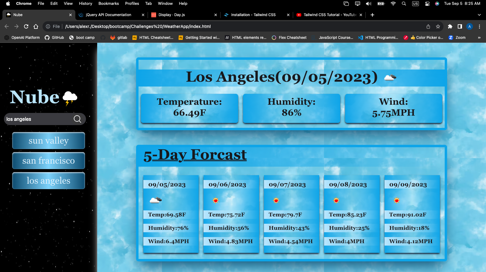

# NUBE a Weather App

## Description

Nube allowes user to search for a major city for the current weather and 5 day forecast 

## Installation

N/A

## Usage
Nube is a weather app. User enter name of major city on search bar. Nube will thei play current weather that is temperature, humidity and wind speeds. Nube will also provide a 5 day forecast. 

## Screenshot 

## Deployment link

https://ayrh1.github.io/Quiz/

## Credits

* [MDN Web Docs on localStorage](https://developer.mozilla.org/en-US/docs/Web/API/Window/localStorage)

* [MDN Web Docs on Window.localStorage](https://developer.mozilla.org/en-US/docs/Web/API/Window/localStorage)

* [MDN Web Docs on JSON.stringify()](https://developer.mozilla.org/en-US/docs/Web/JavaScript/Reference/Global_Objects/JSON/stringify)

* [JQuery Web Docs on event handelers](https://api.jquery.com/)

* [Day.js Web Docs on date formats](https://day.js.org/docs/en/display/display)

* [TailWindCss Docs on css styling](https://tailwindcss.com/docs/installation)

* [youtube creator Net Ninja how to install tailwindcss](https://www.youtube.com/playlist?list=PL4cUxeGkcC9gpXORlEHjc5bgnIi5HEGhw)

## License

Please refer to the LICENSE in the repo.
